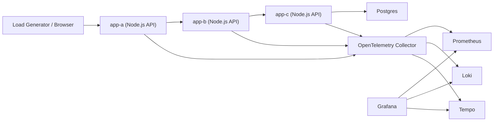

# Local SRE Learning Lab

This project is a local playground for learning practical SRE concepts on Windows with Docker Desktop:

- Golden signals: latency, traffic, errors, saturation
- SLI/SLO design and error budgets
- Metrics, logs, and traces
- Capacity planning basics
- Alerting and resilience patterns
- Automated run summaries
- Load testing and behavior under stress

The lab uses small Node.js applications so we can practice:

- Service-to-service tracing
- Error propagation between services
- Latency analysis
- Load testing and bottleneck discovery

This version now uses three services plus Postgres so the traces are more realistic:

- `app-a` -> `app-b` -> `app-c`
- `app-c` -> `postgres`

## What We Are Building

- `app-a`: entry service that receives user traffic
- `app-b`: middle-tier service called by `app-a`
- `app-c`: deeper dependency called by `app-b`
- OpenTelemetry Collector: central telemetry pipeline
- Prometheus: metrics storage and querying
- Loki: logs storage
- Tempo: traces storage
- Grafana: dashboards and correlation across metrics/logs/traces

## Architecture



## Project Layout

- `docker-compose.yml`: full local stack
- `services/app-a`: entry app
- `services/app-b`: downstream app
- `services/app-c`: deeper dependency app
- `postgres`: seeded demo database
- `grafana/dashboards`: prebuilt Grafana dashboards
- `load-tests`: `k6` traffic scripts
- `otel/collector-config.yaml`: telemetry pipelines
- `prometheus/prometheus.yml`: Prometheus scrape config
- `grafana/provisioning/datasources/datasources.yml`: preconfigured Grafana datasources
- `grafana/provisioning/dashboards/dashboards.yml`: dashboard provisioning
- `docs/learning-plan.md`: what to learn and how to use this repo
- `docs/sli-slo-error-budget.md`: SLIs, SLOs, and error budget examples
- `docs/capacity-planning.md`: capacity planning approach
- `docs/15-minute-capacity-exercise.md`: guided 15-minute exercise, reproduction steps, and dashboard interpretation
- `docs/sre-learning-path.md`: beginner to advanced roadmap for this lab
- `docs/roadmap-v2-v4.md`: staged roadmap for evolving the lab into a more production-like platform
- `docs/sre-learning-interview-guide.md`: learning notes and interview preparation guide
- `docs/incident-runbook.md`: investigation checklist and mitigation guide
- `docs/services-overview.md`: each service, its role, and its telemetry
- `docs/dashboard-panel-guide.md`: each dashboard and panel explained
- `docs/deployment-validation.md`: deployment, validation, and GitHub handoff steps
- `docs/manual-load-testing.md`: exact terminal-driven load testing, including `100 req/sec` examples
- `docs/load-testing-cheatsheet.md`: quick copy-paste load commands for `50`, `100`, and `200 req/sec`

## Quick Start

1. Install Docker Desktop and make sure Linux containers are enabled.
2. Copy `.env.example` to `.env` if you want custom ports, credentials, or report path overrides.
3. From this folder, run:

PowerShell:

```powershell
docker compose up --build
```

Bash:

```bash
docker compose up --build
```

Cross-platform bootstrap scripts:

- Windows PowerShell:
```powershell
.\scripts\bootstrap.ps1
```
- Linux / macOS:
```bash
./scripts/bootstrap.sh
```

4. Open these URLs:

- Grafana: [http://localhost:3000](http://localhost:3000)
- Prometheus: [http://localhost:9090](http://localhost:9090)
- Jaeger: [http://localhost:16686](http://localhost:16686)
- Dozzle logs UI: [http://localhost:8080](http://localhost:8080)
- app-a: [http://localhost:3001/health](http://localhost:3001/health)
- app-b: [http://localhost:3002/health](http://localhost:3002/health)
- app-c: [http://localhost:3003/health](http://localhost:3003/health)
- Postgres: `localhost:5432` (`sre` / `sre`, database `srelab`)
- Browser control panel: [http://localhost:3001](http://localhost:3001)

Grafana default login:

- Username: `admin`
- Password: `admin`

You can override these in `.env`.

## Demo Endpoints

Use `app-a` as the entry point:

- `GET /health`
- `GET /ready`
- `GET /api/demo`

Example:

PowerShell:

```powershell
curl "http://localhost:3001/api/demo?items=3&latencyMs=100"
```

Bash:

```bash
curl "http://localhost:3001/api/demo?items=3&latencyMs=100"
```

To simulate failures:

PowerShell:

```powershell
curl "http://localhost:3001/api/demo?failureRate=0.4"
```

Bash:

```bash
curl "http://localhost:3001/api/demo?failureRate=0.4"
```

To simulate extra CPU work:

PowerShell:

```powershell
curl "http://localhost:3001/api/demo?cpuMs=150"
```

Bash:

```bash
curl "http://localhost:3001/api/demo?cpuMs=150"
```

To simulate deeper dependency latency:

PowerShell:

```powershell
curl "http://localhost:3001/api/demo?dependencyLatencyMs=120"
```

Bash:

```bash
curl "http://localhost:3001/api/demo?dependencyLatencyMs=120"
```

## Load Testing

For exact fixed-rate traffic like `100 req/sec`, use the dedicated guide:

- [docs/manual-load-testing.md](docs/manual-load-testing.md)
- [docs/load-testing-cheatsheet.md](docs/load-testing-cheatsheet.md)

Most common exact `100 req/sec` runs:

PowerShell:

```powershell
docker run --rm -i -v "${PWD}\load-tests:/scripts" grafana/k6 run /scripts/sre-demo.js --env BASE_URL=http://host.docker.internal:3001 --env SCENARIO=fixed --env PRESET=baseline --env RATE=100 --env DURATION=1m
```

```powershell
docker run --rm -i -v "${PWD}\load-tests:/scripts" grafana/k6 run /scripts/sre-demo.js --env BASE_URL=http://host.docker.internal:3001 --env SCENARIO=fixed --env PRESET=retry-storm --env RATE=100 --env DURATION=1m
```

```powershell
docker run --rm -i -v "${PWD}\load-tests:/scripts" grafana/k6 run /scripts/sre-demo.js --env BASE_URL=http://host.docker.internal:3001 --env SCENARIO=fixed --env PRESET=db-saturation --env RATE=100 --env DURATION=1m
```

Bash:

```bash
docker run --rm -i -v "$(pwd)/load-tests:/scripts" grafana/k6 run /scripts/sre-demo.js --env BASE_URL=http://host.docker.internal:3001 --env SCENARIO=fixed --env PRESET=baseline --env RATE=100 --env DURATION=1m
```

```bash
docker run --rm -i -v "$(pwd)/load-tests:/scripts" grafana/k6 run /scripts/sre-demo.js --env BASE_URL=http://host.docker.internal:3001 --env SCENARIO=fixed --env PRESET=retry-storm --env RATE=100 --env DURATION=1m
```

```bash
docker run --rm -i -v "$(pwd)/load-tests:/scripts" grafana/k6 run /scripts/sre-demo.js --env BASE_URL=http://host.docker.internal:3001 --env SCENARIO=fixed --env PRESET=db-saturation --env RATE=100 --env DURATION=1m
```

Use the browser UI for interactive learning. Use `k6` for exact request-rate tests.

`k6` script:

PowerShell:

```powershell
k6 run .\load-tests\sre-demo.js
```

Bash:

```bash
k6 run ./load-tests/sre-demo.js
```

Docker-based `k6` run if you do not want a local install:

PowerShell:

```powershell
docker run --rm -i -v "${PWD}\load-tests:/scripts" grafana/k6 run /scripts/sre-demo.js --env BASE_URL=http://host.docker.internal:3001 --env SCENARIO=baseline
```

Bash:

```bash
docker run --rm -i -v "$(pwd)/load-tests:/scripts" grafana/k6 run /scripts/sre-demo.js --env BASE_URL=http://host.docker.internal:3001 --env SCENARIO=baseline
```

Scenario examples:

PowerShell:

```powershell
k6 run --env SCENARIO=baseline .\load-tests\sre-demo.js
k6 run --env SCENARIO=latency .\load-tests\sre-demo.js
k6 run --env SCENARIO=errors .\load-tests\sre-demo.js
k6 run --env SCENARIO=stress .\load-tests\sre-demo.js
```

Bash:

```bash
k6 run --env SCENARIO=baseline ./load-tests/sre-demo.js
k6 run --env SCENARIO=latency ./load-tests/sre-demo.js
k6 run --env SCENARIO=errors ./load-tests/sre-demo.js
k6 run --env SCENARIO=stress ./load-tests/sre-demo.js
```

Quick smoke test:

PowerShell:

```powershell
k6 run --env SCENARIO=baseline --env QUICK=1 .\load-tests\sre-demo.js
```

Bash:

```bash
k6 run --env SCENARIO=baseline --env QUICK=1 ./load-tests/sre-demo.js
```

Basic PowerShell loop if you do not want to install `k6`:

```powershell
1..100 | ForEach-Object {
  Start-Job { curl "http://localhost:3001/api/demo?latencyMs=50" } | Out-Null
}
```

Or use a dedicated tool like `k6` or `hey` from your machine.

## Suggested Learning Flow

1. Start the stack and generate a small amount of traffic.
2. Open Grafana and inspect:
   - Request rate
   - Latency percentiles
   - Error rate
   - Trace spans between `app-a`, `app-b`, and `app-c`
   - Application logs for failed requests
3. Increase latency and failure rate through query parameters.
4. Define an SLI/SLO target and observe whether the system meets it.
5. Load test the stack and estimate practical local capacity.
6. Translate the observations into a simple capacity plan.

## Included Dashboards

Grafana now auto-loads:

- `SRE Golden Signals`: traffic, latency, errors, and runtime saturation indicators
- `Service Dependency Overview`: request path visibility for `app-a`, `app-b`, and `app-c`
- `SLO and Error Budget`: availability SLI, latency SLI, burn-rate views, and remaining budget
- `Database Health`: Postgres exporter metrics and app-c DB query behavior
- `Capacity Planning`: throughput, p95 latency, error ratio, event-loop pressure, and DB saturation
- `Alerting and Runbook`: alert-condition visibility plus investigation steps

Prometheus alerting now includes:

- latency SLO breach alerts
- fast error-budget burn alerts
- DB latency and connection-pressure alerts
- resilience activity alerts for fallbacks and circuit-breaker events

Resilience patterns in the app now include:

- downstream timeout control
- retry control
- circuit-breaker behavior
- graceful stub fallback mode

Dedicated UIs:

- `Jaeger`: dedicated trace search and span waterfall view
- `Dozzle`: dedicated live container logs view

Deployment and validation steps are documented in:

- [docs/deployment-validation.md](docs/deployment-validation.md)
- [docs/15-minute-capacity-exercise.md](docs/15-minute-capacity-exercise.md)
- [docs/sre-learning-path.md](docs/sre-learning-path.md)
- [docs/roadmap-v2-v4.md](docs/roadmap-v2-v4.md)
- [docs/sre-learning-interview-guide.md](docs/sre-learning-interview-guide.md)
- [docs/incident-runbook.md](docs/incident-runbook.md)
- [docs/services-overview.md](docs/services-overview.md)
- [docs/dashboard-panel-guide.md](docs/dashboard-panel-guide.md)
- [docs/manual-load-testing.md](docs/manual-load-testing.md)

## Session Report Export

After a scheduled run or guided experiment, you can export:

- JSON from the browser UI
- Markdown from the browser UI
- HTML from the browser UI
- PDF with the export script:

PowerShell:

```powershell
.\scripts\export-session-report.ps1 -Pdf
```

Linux / macOS shell:

```bash
python3 -m webbrowser "http://localhost:3001/api/session-report/latest/html"
```

This creates files in `.\reports`.

You can also browse persisted reports in the app at:

- [http://localhost:3001/reports](http://localhost:3001/reports)

## Config Defaults And Overrides

This lab now supports defaults with optional overrides through `.env`.

Examples:

- host ports
- Grafana admin username and password
- Postgres database, user, and password
- DB pool max
- reports host directory

Start from:

- [.env.example](.env.example)

This makes the setup easier to reuse across:

- Windows
- Linux
- macOS

## What Persists After Git Pull Or Restart

If you `git pull` and start the stack again, the application setup comes from code and should work automatically after:

PowerShell:

```powershell
docker compose up --build -d
```

Bash:

```bash
docker compose up --build -d
```

State behavior:

- persists in Docker volume:
  - Postgres data in `postgres_data`
  - app log files in `app_logs`
- recreated from code on startup:
  - Grafana dashboards
  - Prometheus rules
  - application code and routes
  - docs and scripts
- does not persist unless you export it:
  - in-memory browser/guided session history
  - latest generated session report in `app-a`

So:

- your database content stays unless you remove Docker volumes
- your dashboards and rules come from the repo automatically
- session reports are now persisted automatically in `reports`

## Reset Scripts

- Windows PowerShell:
```powershell
.\scripts\reset-lab.ps1
.\scripts\reset-lab.ps1 -RemoveVolumes
```

- Linux / macOS:
```bash
./scripts/reset-lab.sh
./scripts/reset-lab.sh --volumes
```

## Reproduce The 15-Minute Capacity Exercise

Use the dedicated guide here:

- [docs/15-minute-capacity-exercise.md](docs/15-minute-capacity-exercise.md)

That guide explains:

- how the 15-minute run was executed
- which phases were used
- which dashboards to watch during the run
- why low RPS can still produce very high latency
- how to decide whether to scale app containers or fix the database tier first

## Good Extra Topics To Add Later

- Alert rules for burn-rate alerts
- Synthetic checks
- Chaos testing
- Retry and timeout tuning
- Circuit breaker patterns
- Horizontal scaling experiments
- Queue-based workloads
- Database dependency simulation

## Local Machine Note

This project is intended to run on your local machine.

- The repository files live in your local workspace after you clone it.
- Containers started with Docker Desktop or Docker Engine also run locally.
- This is a local lab setup, not a hosted or remote environment.
