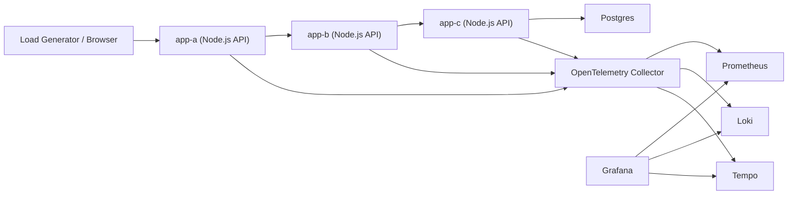

# Local SRE Learning Lab

This project is a local playground for learning practical SRE concepts on Windows with Docker Desktop:

- Golden signals: latency, traffic, errors, saturation
- SLI/SLO design and error budgets
- Metrics, logs, and traces
- Capacity planning basics
- Load testing and behavior under stress

The lab uses small Node.js applications so we can practice:

- Service-to-service tracing
- Error propagation between services
- Latency analysis
- Load testing and bottleneck discovery

This version now uses three services plus Postgres so the traces are more realistic:

- `app-a` -> `app-b` -> `app-c`
- `app-c` -> `postgres`

## What We Are Building

- `app-a`: entry service that receives user traffic
- `app-b`: middle-tier service called by `app-a`
- `app-c`: deeper dependency called by `app-b`
- OpenTelemetry Collector: central telemetry pipeline
- Prometheus: metrics storage and querying
- Loki: logs storage
- Tempo: traces storage
- Grafana: dashboards and correlation across metrics/logs/traces

## Architecture



## Project Layout

- `docker-compose.yml`: full local stack
- `services/app-a`: entry app
- `services/app-b`: downstream app
- `services/app-c`: deeper dependency app
- `postgres`: seeded demo database
- `grafana/dashboards`: prebuilt Grafana dashboards
- `load-tests`: `k6` traffic scripts
- `otel/collector-config.yaml`: telemetry pipelines
- `prometheus/prometheus.yml`: Prometheus scrape config
- `grafana/provisioning/datasources/datasources.yml`: preconfigured Grafana datasources
- `grafana/provisioning/dashboards/dashboards.yml`: dashboard provisioning
- `docs/learning-plan.md`: what to learn and how to use this repo
- `docs/sli-slo-error-budget.md`: SLIs, SLOs, and error budget examples
- `docs/capacity-planning.md`: capacity planning approach
- `docs/deployment-validation.md`: deployment, validation, and GitHub handoff steps

## Quick Start

1. Install Docker Desktop and make sure Linux containers are enabled.
2. From this folder, run:

```powershell
docker compose up --build
```

3. Open these URLs:

- Grafana: [http://localhost:3000](http://localhost:3000)
- Prometheus: [http://localhost:9090](http://localhost:9090)
- Jaeger: [http://localhost:16686](http://localhost:16686)
- Dozzle logs UI: [http://localhost:8080](http://localhost:8080)
- app-a: [http://localhost:3001/health](http://localhost:3001/health)
- app-b: [http://localhost:3002/health](http://localhost:3002/health)
- app-c: [http://localhost:3003/health](http://localhost:3003/health)
- Postgres: `localhost:5432` (`sre` / `sre`, database `srelab`)
- Browser control panel: [http://localhost:3001](http://localhost:3001)

Grafana default login:

- Username: `admin`
- Password: `admin`

## Demo Endpoints

Use `app-a` as the entry point:

- `GET /health`
- `GET /ready`
- `GET /api/demo`

Example:

```powershell
curl "http://localhost:3001/api/demo?items=3&latencyMs=100"
```

To simulate failures:

```powershell
curl "http://localhost:3001/api/demo?failureRate=0.4"
```

To simulate extra CPU work:

```powershell
curl "http://localhost:3001/api/demo?cpuMs=150"
```

To simulate deeper dependency latency:

```powershell
curl "http://localhost:3001/api/demo?dependencyLatencyMs=120"
```

## Load Testing

`k6` script:

```powershell
k6 run .\load-tests\sre-demo.js
```

Docker-based `k6` run if you do not want a local install:

```powershell
docker run --rm -i -v "${PWD}\load-tests:/scripts" grafana/k6 run /scripts/sre-demo.js --env BASE_URL=http://host.docker.internal:3001 --env SCENARIO=baseline
```

Scenario examples:

```powershell
k6 run --env SCENARIO=baseline .\load-tests\sre-demo.js
k6 run --env SCENARIO=latency .\load-tests\sre-demo.js
k6 run --env SCENARIO=errors .\load-tests\sre-demo.js
k6 run --env SCENARIO=stress .\load-tests\sre-demo.js
```

Quick smoke test:

```powershell
k6 run --env SCENARIO=baseline --env QUICK=1 .\load-tests\sre-demo.js
```

Basic PowerShell loop if you do not want to install `k6`:

```powershell
1..100 | ForEach-Object {
  Start-Job { curl "http://localhost:3001/api/demo?latencyMs=50" } | Out-Null
}
```

Or use a dedicated tool like `k6` or `hey` from your machine.

## Suggested Learning Flow

1. Start the stack and generate a small amount of traffic.
2. Open Grafana and inspect:
   - Request rate
   - Latency percentiles
   - Error rate
   - Trace spans between `app-a`, `app-b`, and `app-c`
   - Application logs for failed requests
3. Increase latency and failure rate through query parameters.
4. Define an SLI/SLO target and observe whether the system meets it.
5. Load test the stack and estimate practical local capacity.
6. Translate the observations into a simple capacity plan.

## Included Dashboards

Grafana now auto-loads:

- `SRE Golden Signals`: traffic, latency, errors, and runtime saturation indicators
- `Service Dependency Overview`: request path visibility for `app-a`, `app-b`, and `app-c`
- `SLO and Error Budget`: availability SLI, latency SLI, burn-rate views, and remaining budget
- `Database Health`: Postgres exporter metrics and app-c DB query behavior
- `Capacity Planning`: throughput, p95 latency, error ratio, event-loop pressure, and DB saturation

Dedicated UIs:

- `Jaeger`: dedicated trace search and span waterfall view
- `Dozzle`: dedicated live container logs view

Deployment and validation steps are documented in:

- [docs/deployment-validation.md](C:/Users/smuvva/Documents/New%20project/docs/deployment-validation.md)

## Good Extra Topics To Add Later

- Alert rules for burn-rate alerts
- Synthetic checks
- Chaos testing
- Retry and timeout tuning
- Circuit breaker patterns
- Horizontal scaling experiments
- Queue-based workloads
- Database dependency simulation

## About Sandbox vs Local Machine

This project is created in your local workspace at:

`C:\Users\smuvva\Documents\New project`

The files are on your local machine. Containers started with Docker Desktop also run on your machine. In short: yes, this is a local setup, not a remote lab.
